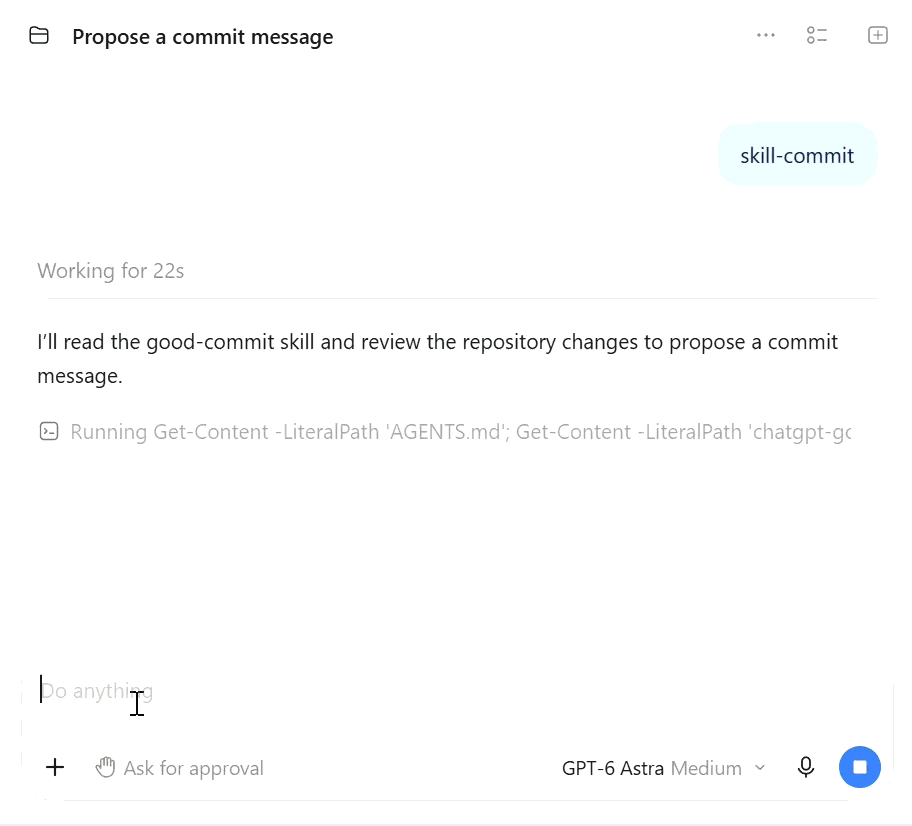

# Agent Toolbox

A growing collection of reusable AI agent skills, policies, and workflows for everyday development. Start with clear commit messages and explicit security boundaries, then adapt the tools to your project.

## 🎬 Good Commit Demo

See how the [Good Commit skill](.codex/skills/good-commit/SKILL.md) proposes a Conventional Commit message from your Git changes without automatically committing or pushing.



## What's included

| Resource | Purpose |
| --- | --- |
| [Good Commit](.codex/skills/good-commit/SKILL.md) | Propose Conventional Commit messages with a scope and semantic emoji. |
| [Security Guardian](.codex/skills/security-guardian/SKILL.md) | Define approval requirements, file access boundaries, and database access rules. |
| [Project instructions](AGENTS.md) | Route the `/skill-commit` shortcut to the commit skill. |
| [Todo demo](src/todo.js) | Provide a small JavaScript example for trying the commit workflow. |

## Get started

```bash
git clone https://github.com/zmo2s/agent-toolbox.git
cd agent-toolbox
```

Explore the resources below, or copy the ones you need into your own project.

## Security Guardian

The [Security Guardian skill](.codex/skills/security-guardian/SKILL.md) describes a default-deny, least-privilege policy for agent-assisted work:

- Explain each command's purpose, scope, and risks before requesting approval.
- Require approval before file modifications and keep access within approved directories, including symlink targets.
- Never silently rewrite Git history, install packages, run remote scripts, or disable security controls.
- Require authorization for network access; prohibit deployment and external publishing under the policy as written.
- Keep secrets out of responses and logs, and never use production credentials.
- Access databases only through a configured user with database-enforced read-only permissions. If none is configured, stop without falling back to another account.
- Report verified findings, suspected risks, and checks actually performed.

### Use it in your project

1. Copy `.codex/skills/security-guardian/` into your repository's `.codex/skills/` folder.
2. Review the policy and define the approved directories and task scope.
3. Explicitly instruct your agent to read and follow it before starting work.
4. Configure actual filesystem, network, and database permissions to match your intended restrictions.

Example instruction:

> Use the security-guardian skill at .codex/skills/security-guardian/SKILL.md for this task. Limit file access to this repository. Explain proposed commands and changes, and wait for my approval before executing them.

This skill provides policy instructions, not enforced security controls. It does not enforce permissions, prevent every unsafe action, or replace sandboxing and human review.

## Good Commit

The [Good Commit skill](.codex/skills/good-commit/SKILL.md) inspects Git changes and proposes a concrete message. A bare request does not authorize staging, committing, or pushing.

Edit the todo demo or a test, then send:

```text
/skill-commit
```

The project's `AGENTS.md` routes this text shortcut to the skill. It is a project instruction, not a native slash-menu autocomplete entry.

You can also ask:

> Use the good-commit skill to prepare a commit message for my current changes.

Responses use blue markers (🔷 / 🔹) to distinguish the proposal, changes, checks, and Git status. Every copyable commit subject uses:

```text
<type>(<scope>): <emoji> <description>
```

For example:

```text
fix(core): 🐛 reject empty todo titles
docs(security): 📝 add guardian policy with read-only database rules
```

The skill distinguishes staged and unstaged changes, flags breaking changes, and proposes separate commits for unrelated work.

See [the no-changes example](docs/examples/no-changes.md) for the response
when the working tree is clean.

To reuse it, copy `.codex/skills/good-commit/SKILL.md` and merge the shortcut instructions from `AGENTS.md` into your project's existing instructions.

## Run the demo tests

With Node.js installed:

```bash
npm test
```

## Structure

```text
agent-toolbox/
├── .codex/skills/
│   ├── good-commit/SKILL.md
│   └── security-guardian/SKILL.md
├── AGENTS.md
├── src/todo.js
├── test/todo.test.js
├── package.json
├── LICENSE
└── README.md
```

## Contributing

Ideas, improvements, and pull requests are welcome! Help improve existing policies, add reusable skills, or share practical workflows.

Keep each PR focused, explain the problem it solves, and include usage examples and any checks you performed. For security-related changes, describe what the policy asks an agent to do and which protections require external enforcement.

## License

See [LICENSE](LICENSE) for the license terms.
